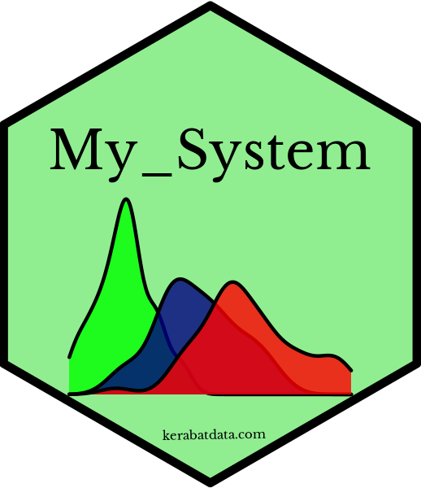

# hexStiker

```
# : My_System (lightgreen)
library(ggplot2)
library(hexStiker)

my_stiker <- ggplot(iris, aes(x = Sepal.Length, fill = Species)) +
  geom_density(alpha = 0.8) +
  scale_fill_manual(values=c("green", "navy", "red")) +
  theme_void() + theme_transparent() +
  theme(legend.position = "none")
my_stiker

sticker(my_stiker ,package="My_System", p_size=17, s_x=1, s_y=.78, s_width=1.3, s_height=0.9,
        h_fill="lightgreen", h_color="black",
        p_color = "black",
        p_family = "baskerville",
        url = "kerabatdata.com",u_color = "black", u_family = "baskerville",
        u_size = 4, u_angle = 1, u_x = 0.8, u_y = .2,
        filename="img/my_stiker.png")

```

